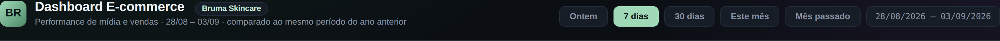
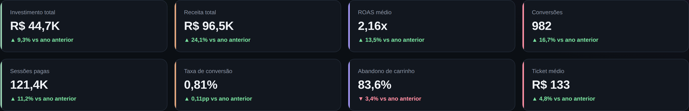
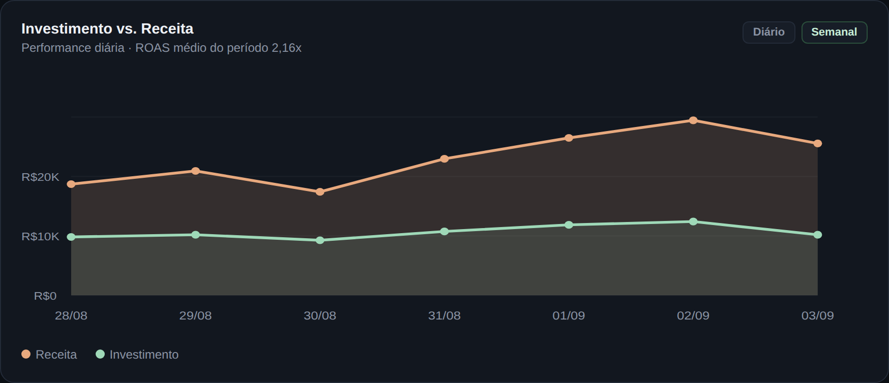
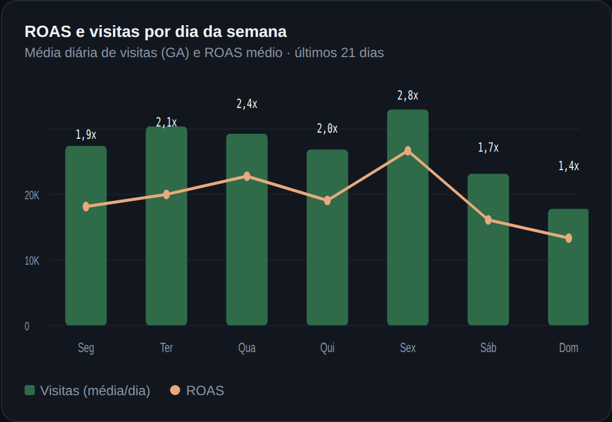
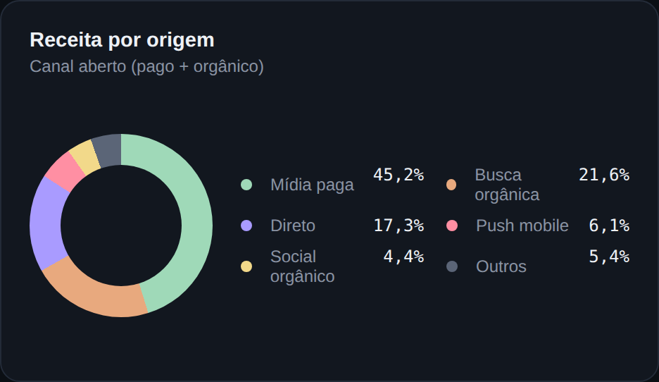
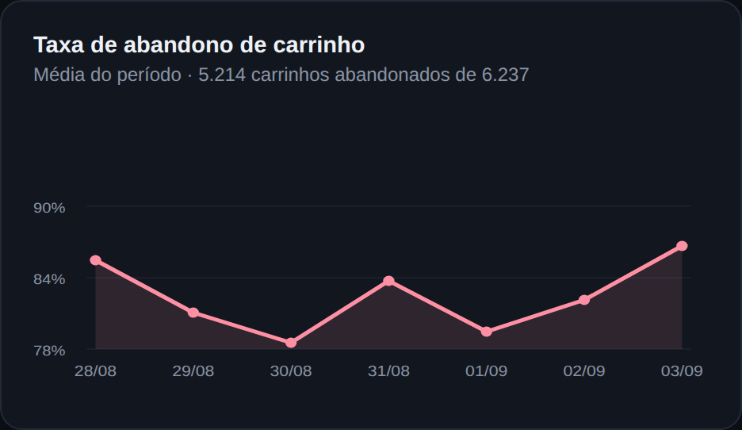
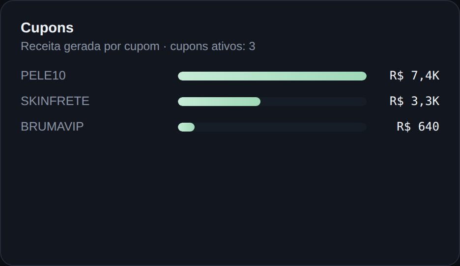
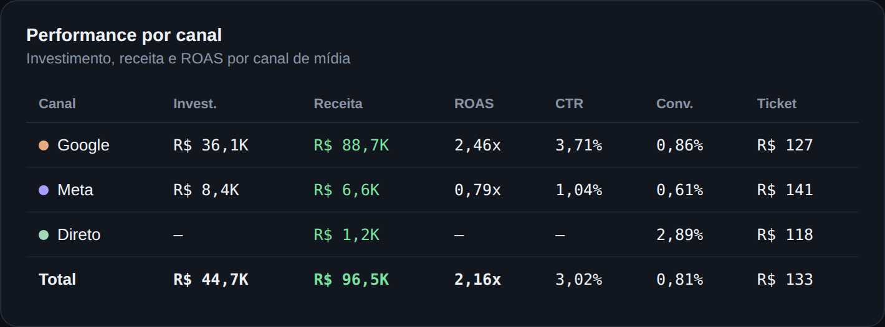
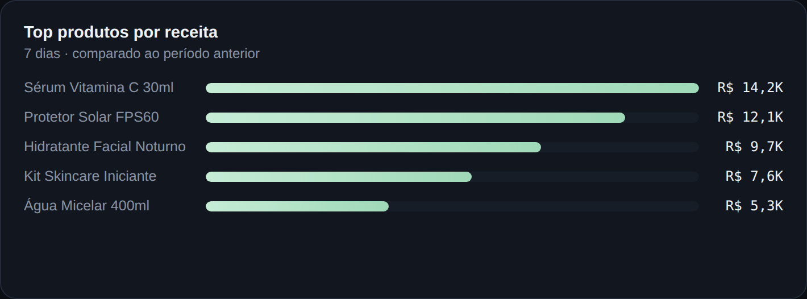
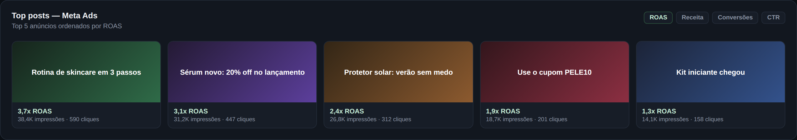

# Dashboard E-commerce — Bruma Skincare

Dashboard de performance de mídia e vendas para e-commerce, construído como peça de portfólio de Business Intelligence.

🔗 **Demo ao vivo:** ative o GitHub Pages neste repositório para gerar o link (veja instruções no final deste README).

> **Nota:** todos os dados exibidos são fictícios, criados exclusivamente para fins de demonstração e portfólio, para uma marca de skincare imaginária (Bruma Skincare). Não representam números reais de nenhuma empresa.

## Stack

- HTML5 + CSS3 (grid/flexbox, sem framework)
- SVG nativo para os gráficos (sem dependências externas de JS)
- Totalmente responsivo e funciona offline, sem precisar de servidor ou build

## Como visualizar

Basta abrir o arquivo `index.html` em qualquer navegador — não precisa de instalação nem de servidor local.

---

## Visão geral do dashboard

### Cabeçalho e filtros de período

Identificação da marca e do painel, com os filtros de período (ontem, 7 dias, 30 dias, este mês, mês passado) e o intervalo de datas selecionado. Esses controles simulam a navegação que um analista usaria para comparar performance entre diferentes janelas de tempo.

### Indicadores principais (KPIs)

Os oito indicadores centrais do negócio em um único relance: investimento total, receita total, ROAS médio, número de conversões, sessões pagas, taxa de conversão, taxa de abandono de carrinho e ticket médio — cada um com a variação percentual em relação ao mesmo período do ano anterior.

### Investimento vs. Receita

Evolução diária do investimento em mídia comparado à receita gerada, permitindo visualizar rapidamente se o retorno está acompanhando o aumento de verba investida ao longo da semana.

### ROAS e visitas por dia da semana

Cruza o volume médio de visitas (barras) com o ROAS médio (linha) de cada dia da semana, ajudando a identificar os dias mais eficientes para concentrar investimento em mídia.

### Receita por origem

Distribuição percentual da receita entre os canais de aquisição: mídia paga, busca orgânica, acesso direto, push mobile, social orgânico e outras origens.

### Taxa de abandono de carrinho

Variação diária da taxa de abandono de carrinho no período, um indicador-chave para identificar gargalos no funil de checkout.

### Cupons

Ranking dos cupons ativos por receita gerada, útil para avaliar quais campanhas promocionais estão performando melhor.

### Performance por canal

Comparativo detalhado entre os canais de mídia (Google, Meta e canal direto), com investimento, receita, ROAS, CTR, taxa de conversão e ticket médio de cada um, além do total consolidado.

### Top produtos por receita

Os cinco produtos que mais geraram receita no período, permitindo identificar os itens de maior desempenho no catálogo.

### Top posts — Meta Ads

Os cinco anúncios de melhor performance no Meta Ads, ordenados por ROAS, com impressões e cliques de cada criativo.

---

## Como publicar com GitHub Pages

1. Vá em **Settings → Pages** neste repositório
2. Em **Source**, selecione a branch `main` e a pasta `/root`
3. Salve — em alguns minutos o link ao vivo aparece no topo da página de Pages

## Autora

**Giovanna Gomes Oliveira**
Business Intelligence Analyst · [GIO TECH](#)
